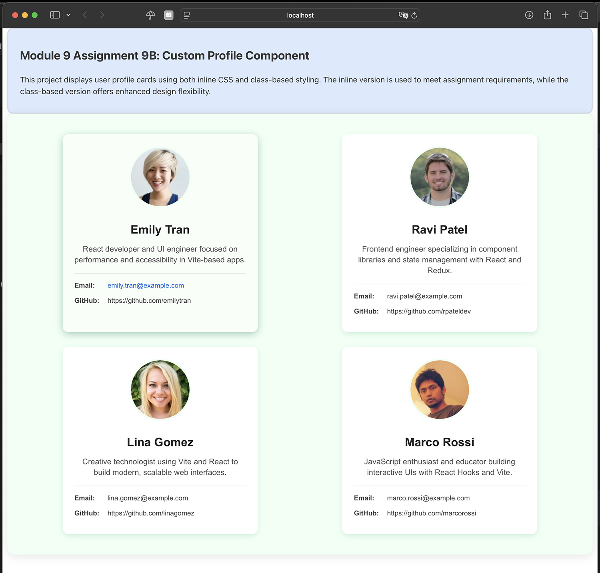

# CS81 Module 9B – Custom Profile Component with Inline Styling

This project is part of **Module 9 Assignment 9B** for Santa Monica College's CS81 JavaScript Programming course.  
It demonstrates how to build reusable profile components in React using both **inline CSS styling** and **external class-based styles**, showcasing layout, props, and hover effects.

---

## Description

This React app was created using Vite and renders a set of user profile cards using modular components.  
Each profile includes an image, name, bio, and contact information (email + GitHub). The project demonstrates:

- Usage of **inline CSS** (required by the assignment)
- Dynamic rendering of profiles from external data
- Modular component structure with props
- Optional **hover effects** for interactive feedback
- A second dataset with tech-relevant users

Two profile components are available:
- `UserProfileInline` — inline-styled version (used for assignment submission)
- `UserProfile` — external CSS version (cleaner and more scalable)

---

## Screenshot

<details>
  <summary> Click to view screenshot with comments</summary>

A screenshot of your rendered UserProfile components (showing layout, styling, and ContactCard):



</details>

---

## Getting Started

1. **Clone the repository**

```bash
git clone https://github.com/sergehall/module9b-profile
cd module9b-profile
```

2. **Install Node.js** (if not already installed)

- Visit https://nodejs.org and download for your system.

3. **Install dependencies**
```bash
npm install
```
4. **Start the development server**
```bash
npm run dev
```

## Repository Structure

```
.
├── public/
│   └── my-new-favicon.ico
├── src/
│   ├── assets/               # Optional assets folder (e.g. images)
│   ├── components/
│   │   ├── Assignment9A.jsx
│   │   ├── AssignmentHeader.jsx
│   │   ├── ContactCard.jsx
│   │   ├── UserList.jsx
│   │   ├── UserProfile.jsx             # CSS class-based version
│   │   └── UserProfileInline.jsx      # Inline CSS version
│   ├── data/
│   │   ├── userProfiles.js            # Data from Module 9A
│   │   └── frontendProfiles.js        # Updated tech-focused profiles for 9B
│   ├── styles/
│   │   └── styles.css
│   ├── App.jsx
│   ├── index.css
│   └── main.jsx
├── index.html
├── vite.config.js
└── README.md
```

---

## What I Learned

- How to build and export modular React components
- How to use props to pass dynamic content (name, image, bio, etc.)
- How to use inline styles to control layout and appearance
- How to implement hover interactions using useState
- How to conditionally switch between data sets and components

---

## Challenges

- Creating clean inline CSS that mimics external class-based styling
- Implementing hover transitions without a stylesheet
- Structuring consistent layout across cards with minimal duplication
- Balancing assignment constraints with scalable component design

---

## Submission Requirements

- [x] Inline-styled component (UserProfileInline)
- [x] External stylesheet component (UserProfile) for comparison
- [x] Contact section with email + GitHub using inline styling
- [x] React map() rendering from imported data file
- [x] Clean component structure and prop usage
- [x] Hover effects on profile and links

---

## License

This project is for educational use only as part of Santa Monica College's CS81 coursework.
